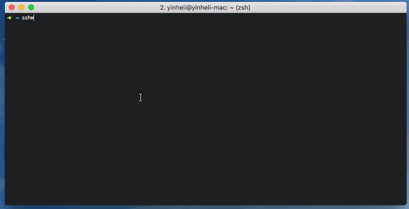

# sshw

[](https://travis-ci.org/yinheli/sshw)

ssh 客户端包装器,用于自动登录.



## 安装

使用`go get`

```
go get -u github.com/yinheli/sshw/cmd/sshw
```

或从[发布](//github.com/yinheli/sshw/releases)页面下载二进制文件.

## 配置

将配置文件放入`~/.sshw`.

配置示例:

```yaml
- {
    name: dev server fully configured,
    user: appuser,
    host: 192.168.8.35,
    port: 22,
    password: 123456,
  }
- {
    name: dev server with key path,
    user: appuser,
    host: 192.168.8.35,
    port: 22,
    keypath: /root/.ssh/id_rsa,
  }
- {
    name: dev server with passphrase key,
    user: appuser,
    host: 192.168.8.35,
    port: 22,
    keypath: /root/.ssh/id_rsa,
    passphrase: abcdefghijklmn,
  }
- {name: dev server without port, user: appuser, host: 192.168.8.35}
- {name: dev server without user, host: 192.168.8.35}
- {name: dev server without password, host: 192.168.8.35}
- {name: ⚡️ server with emoji name, host: 192.168.8.35}

# server group 1
- name: server group 1
  children:
    - {name: server 1, user: root, host: 192.168.1.2}
    - {name: server 2, user: root, host: 192.168.1.3}
    - {name: server 3, user: root, host: 192.168.1.4}

# server group 2
- name: server group 2
  children:
    - {name: server 1, user: root, host: 192.168.2.2}
    - {name: server 2, user: root, host: 192.168.3.3}
    - {name: server 3, user: root, host: 192.168.4.4}
```
